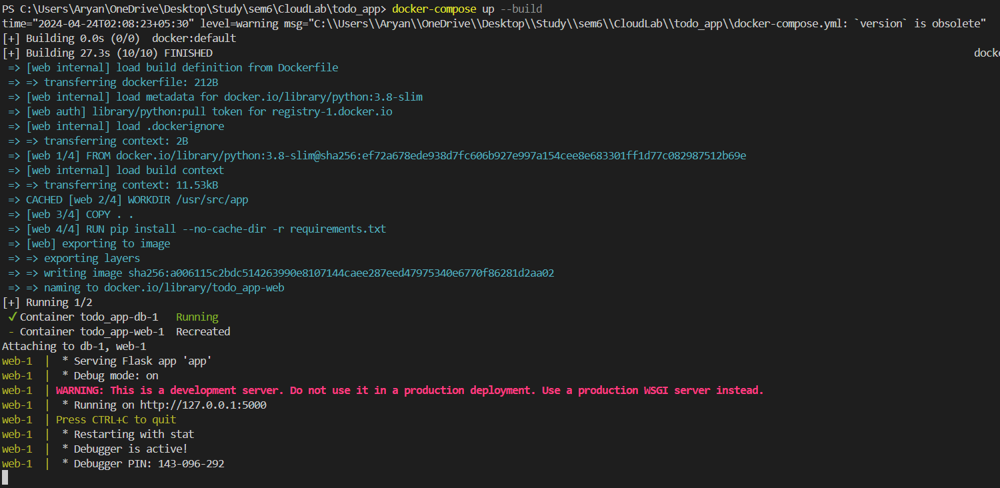
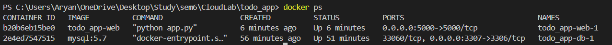
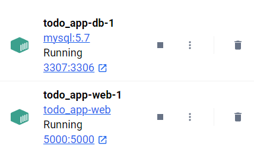
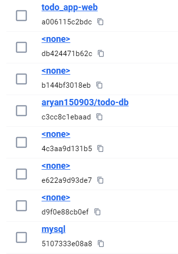
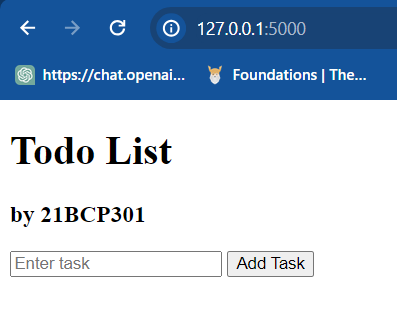
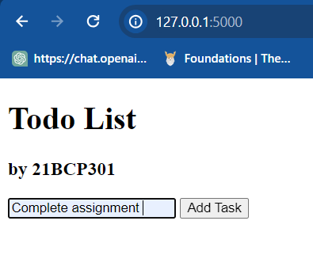
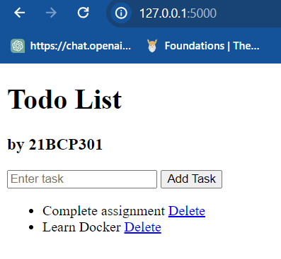
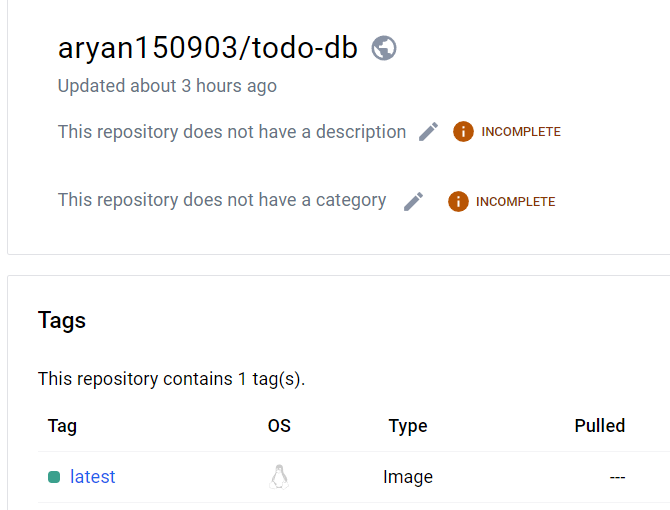

# Tutorial: Building a Three-Tier Application with Docker
### - 21BCP301
In this tutorial, we'll create a three-tier application using Docker, consisting of a presentation tier (front end), an application tier (back end), and a data tier (database). We'll use Docker's multi-container setup, along with Dockerfiles to build at least one Docker image.

<h2>Prerequisites:</h2>

* Basic understanding of Docker
* Docker installed on your machine

<h2>Tools and Technologies Used:</h2>
* Docker
* HTML/CSS/ (for front end)
* Flask (for back end)
* MySQL (for database)

<h2>Frontend</h2>
### To set up the frontend:

* Create HTML files in the templates folder inside your project directory.
* Create CSS files in the static/css folder inside your project directory.
* Set up the HTML and CSS code as required.

index.html
```angular2html
<!DOCTYPE html>
<html lang="en">
<head>
    <meta charset="UTF-8">
    <meta name="viewport" content="width=device-width, initial-scale=1.0">
    <title>Todo List</title>
</head>
<body>
    <h1>Todo List</h1>
    <h3>by 21BCP301</h3>
    <form action="/add" method="POST">
        <input type="text" name="task" placeholder="Enter task">
        <button type="submit">Add Task</button>
    </form>
    <ul>
        
            <li>{{ task[1] }} <a href="/delete/{{ task[0] }}">Delete</a></li>
        
    </ul>
</body>
</html>
```

<h2>Backend</h2>
app.py
```python
from flask import Flask, render_template, request, redirect, url_for
import mysql.connector

app = Flask(__name__)

config = {
    'user': 'root',  # Replace 'root' with your MySQL username
    'password': '1234',  # Replace 'password' with your MySQL password
    'host': 'localhost',
    'database': 'todo_db',  # Make sure this database exists or create it
    'raise_on_warnings': True
}

def get_db_connection():
    conn = mysql.connector.connect(**config)
    return conn

def create_table():
    conn = get_db_connection()
    cursor = conn.cursor()
    cursor.execute('''SHOW TABLES LIKE 'tasks' ''')
    if cursor.fetchone() is None:
        cursor.execute('''CREATE TABLE tasks
                          (id INT AUTO_INCREMENT PRIMARY KEY, task VARCHAR(255))''')
        conn.commit()
    conn.close()


@app.route('/')
def index():
    create_table()
    conn = get_db_connection()
    cursor = conn.cursor()
    cursor.execute("SELECT * FROM tasks")
    tasks = cursor.fetchall()
    conn.close()
    return render_template('index.html', tasks=tasks)

@app.route('/add', methods=['POST'])
def add():
    task = request.form['task']
    conn = get_db_connection()
    cursor = conn.cursor()
    cursor.execute("INSERT INTO tasks (task) VALUES (%s)", (task,))
    conn.commit()
    conn.close()
    return redirect(url_for('index'))

@app.route('/delete/<int:id>')
def delete(id):
    conn = get_db_connection()
    cursor = conn.cursor()
    cursor.execute("DELETE FROM tasks WHERE id = %s", (id,))
    conn.commit()
    conn.close()
    return redirect(url_for('index'))

if __name__ == '__main__':
    app.run(debug=True)
```

<h2>Database</h2>
* MySQL is used as the database.
* Database setup is completed in app.py.

<h2>Docker Setup</h2>

Create a <code>Dockerfile</code> in the root directly

```dockerfile
FROM python:3.8-slim

WORKDIR /usr/src/app

COPY . .

RUN pip install --no-cache-dir -r requirements.txt

EXPOSE 5000

ENV NAME World

CMD ["python", "app.py"]
```

Create a <code>docker-compose.yml</code> file

```yaml
version: '3.1'

services:
  db:
    image: mysql:5.7
    environment:
      MYSQL_ROOT_PASSWORD: 1234
      MYSQL_DATABASE: todo_db
    ports:
      - "3307:3306" 
    volumes:
      - db_data:/var/lib/mysql

  web:
    build: .
    environment:
      - MYSQL_HOST=db
    ports:
      - "5000:5000"
    depends_on:
      - db

volumes:
  db_data:

```

Add the <code>requirements.txt</code>

```text
flask~=3.0.0
mysql-connector-python
```

Here the complete code setup is done.
Now run the command to run the app:

For initial containerization
```commandline
docker-compose up
```

Run this if you have made any changes 
```commandline
docker-compose up --build
```
<h3>Accessing the Application</h3>
Once the application is running, you can access it in your web browser at http://localhost:5000.

<h3>Stopping the Application</h3>
To stop the application and shut down the containers, press Ctrl + C in the terminal where the docker-compose up command was run.

# Result
Running the command <code>docker-compose up --build</code>



Containers created 
used command : <code>docker ps</code>



Containers created in the <b>Docker Desktop</b>




Images created in <b>Docker Desktop</b>


### TODO WEBAPP 





## Docker Hub

Now push the image to Dockerhub
* In this case only flask image needs to be pushed in the dockerhub.
* MySQL image is already available

Follow this steps/commands to push the image: 

1. Create an account on [hub.docker.com](https://hub.docker.com/)
2. To push the image to docker hub run the following commands

```commandline
docker build -t aryan150903/todo_db .
docker login
docker push aryan150903/todo_db
```
Result: 
```commandline
Using default tag: latest
The push refers to repository [docker.io/aryan150903/todo-db]
82cb948f17dd: Pushed
c803286c183d: Pushed
e6b485bec0e7: Pushed
2adfe632ae1c: Mounted from library/python
a03ae7e93f37: Mounted from library/python
e35535ad594c: Mounted from library/python
bfc9081d1eb2: Mounted from library/python
1f00ff201478: Mounted from library/python
latest: digest: sha256:39078e2e9d8b44365e496918ccd82bcca9ad08714711fc4eb8b1efb504a3e1f4 size: 1998
```

